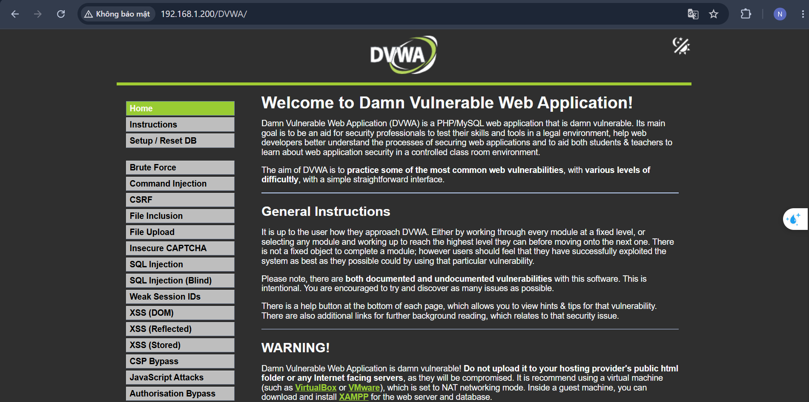
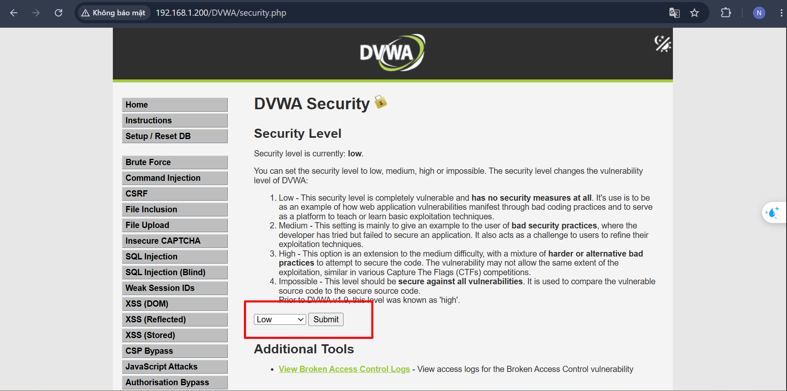

# Lab Setup

## Environment

| Component | Version |
|----------|----------|
| VMware Workstation | 17 Pro |
| Ubuntu Server | 24.04 LTS |
| Kali Linux | 2026.x |
| DVWA | Latest |
| Apache | 2.4 |
| PHP | 8.3 |
| MariaDB | 11.x |

---

## Network

**Bridge**

`Kali: 192.168.100.10`

`Ubuntu: 192.168.100.20`

`Gateway: 192.168.100.1`

---


## VM Specification

**Ubuntu**
- RAM: 2GB
- CPU: 2 Core (*1 processor; 1 core per processor*)
- Disk: 30GB

**Kali**
- RAM: 4GB
- CPU: 2 Core
- Disk: 40GB

---

## Installed Packages

### 1. Apache
**Cài đặt**
```bash
sudo apt install apache2 -y
```

**Kiểm tra**
```bash
sudo systemctl status apache2
```

### 2. PHP
**Cài đặt**
```bash
sudo apt install php libapache2-mod-php php-mysql php-gd php-xml php-mbstring php-curl php-zip -y
```

**Kiểm tra**
```bash
php -v
```


### 3. Mariadb-server
**Cài đặt**
```bash
sudo apt install mariadb-server mariadb-client -y
```

**Chạy và khởi động cùng hệ thống**
```bash
sudo systemctl enable --now mariadb
```

### 4. git
**Cài đặt**
```bash
sudo apt install git -y
```

**Kiểm tra**
```bash
git -v
```

### 5. DVWA
**Clone project**
```bash
cd /var/www/html
sudo git clone https://github.com/digininja/DVWA.git
```

## Initial Configuration

### 1. Quyền thư mục
```bash
sudo chown -R www-data:www-data /var/www/html/DVWA
sudo chmod -R 755 /var/www/html/DVWA
```

### 2. Cấu hình PHP
**Sửa để phù hợp việc học pentest**
```bash
sudo vi /etc/php/*/apache2/php.ini
```

Sửa

```
allow_url_include = On 
```
**--> Cho phép các hàm include(), require() tải và thực hiện mã từ các máy chủ khác**

```
allow_url_fopen = On 
```
**--> Cho phép PHP mở tệp**

```
display_errors
    Default Value:      On
    Development Value:  On
    Production Value:   On
```
**--> Hiện thị chi tiết lỗi ra bên ngoài**
    
**Khởi động lại Apache**
```bash
sudo systemctl restart apache2
```
### 3. Tạo DB

**Đăng nhập DB**
```bash
sudo mysql
```

```sql
CREATE DATABASE dvwa;

CREATE USER 'dvwa'@'localhost' IDENTIFIED BY 'dvwa123';

GRANT ALL PRIVILEGES ON dvwa.* TO 'dvwa'@'localhost';

FLUSH PRIVILEGES;

EXIT;
```

### 4. DVWA config
```bash
cd /var/www/html/DVWA/config
sudo cp config.inc.php.dist config.inc.php
```

**Sửa**
```
$_DVWA['db_server'] = '127.0.0.1';
$_DVWA['db_database'] = 'dvwa';
$_DVWA['db_user'] = 'dvwa';
$_DVWA['db_password'] = 'dvwa123';
```

```bash
sudo systemctl restart apache2
```

## Access
Truy cập: http://192.168.1.200/DVWA\
Đăng nhập: `admin/password`

**Giao diện**


**Đổi level**\
`http://192.168.1.200/DVWA/security.php`




