# **Brute Force**

## **Tổng quan**

Brute Force là kỹ thuật thử liên tục nhiều tổ hợp **tên đăng nhập (username)** và **mật khẩu (password)** cho đến khi tìm được thông tin đăng nhập chính xác.

Lỗ hổng này thường xuất hiện khi chức năng đăng nhập không có các cơ chế bảo vệ như:

- Giới hạn số lần đăng nhập sai (**rate limiting**).
- Khóa tài khoản tạm thời (**account lockout**).
- CAPTCHA.
- Xác thực đa yếu tố (**MFA**).
- Chính sách mật khẩu mạnh.

Trong DVWA, mục tiêu của bài lab là phân tích request đăng nhập và thử nhiều mật khẩu để truy cập vào tài khoản hợp lệ. Ở mỗi mức bảo mật **Low, Medium và High**, ứng dụng sẽ bổ sung thêm các cơ chế làm chậm hoặc hạn chế quá trình Brute Force.

## **Security Level**
### **Low**
#### **Cách khai thác**
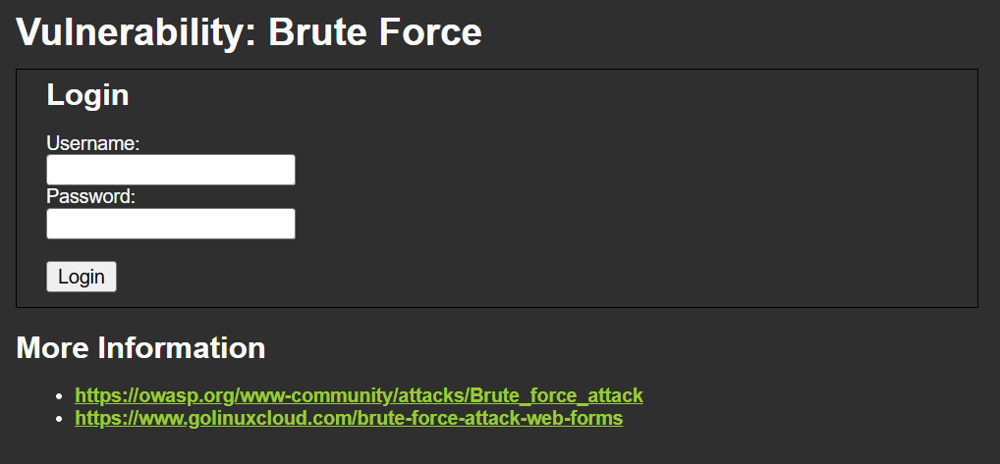

Khi vào trang ta thấy 1 form đăng nhập

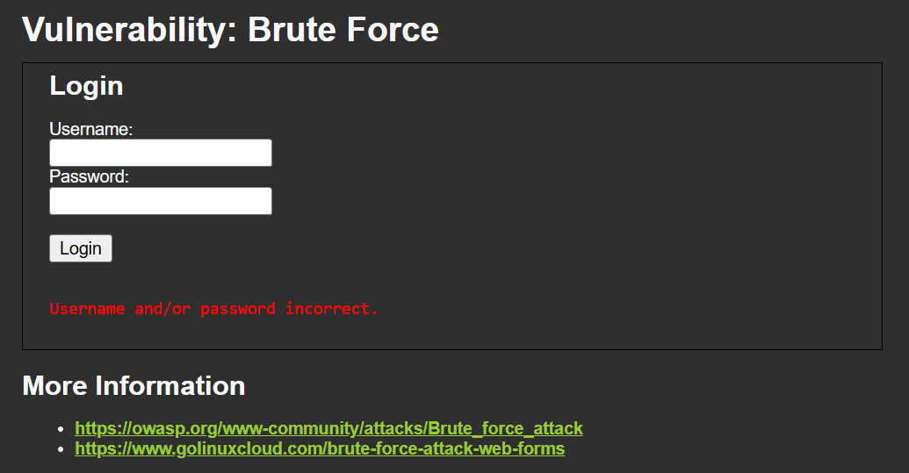

Ta thử 1 request hợp lệ với `username/password`: `test/test`\
Ta thấy được web trả về `Username and/or password incorrect.`

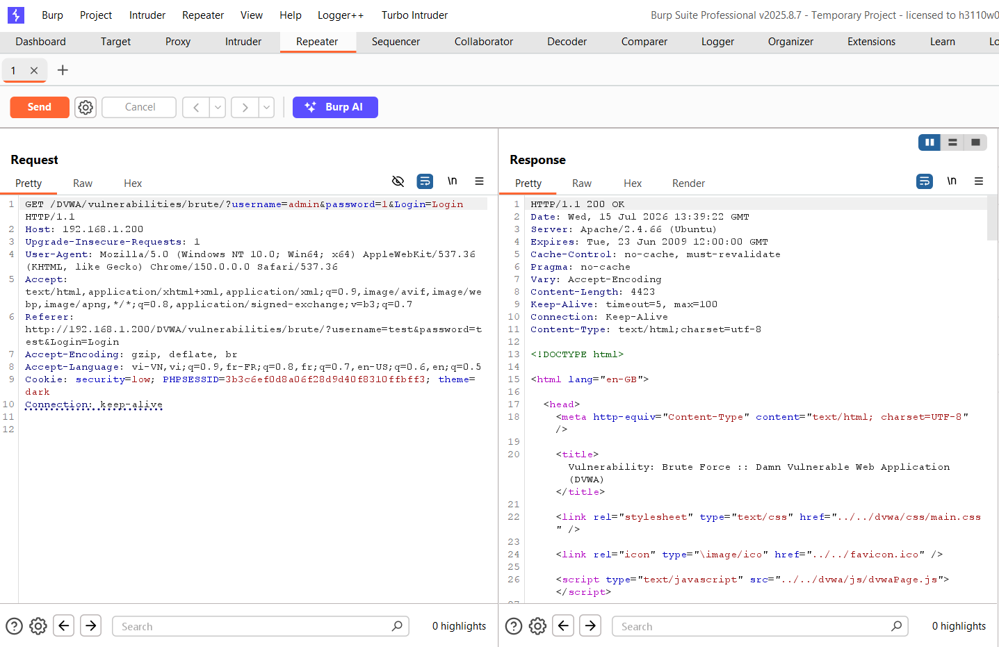

Sử dụng Burp để quan sát request, ta thấy được request được gửi đi với method `GET` và phần thông tin đăng nhập thì được đưa vào 2 tham số trực tiếp trên URL chứ không ở phần body request (data)

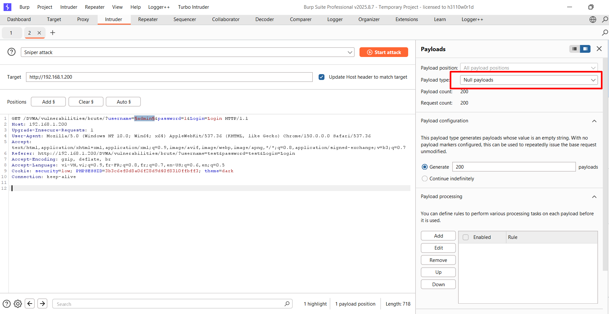

Ta thử gửi 200 request liên tục bằng Null payloads

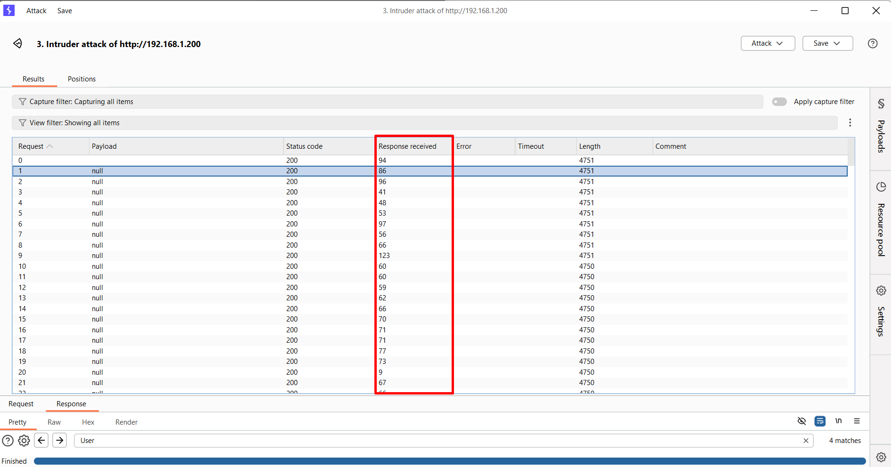

Kết quả cho thấy thời gian phản hồi khá nhanh và đồng đều

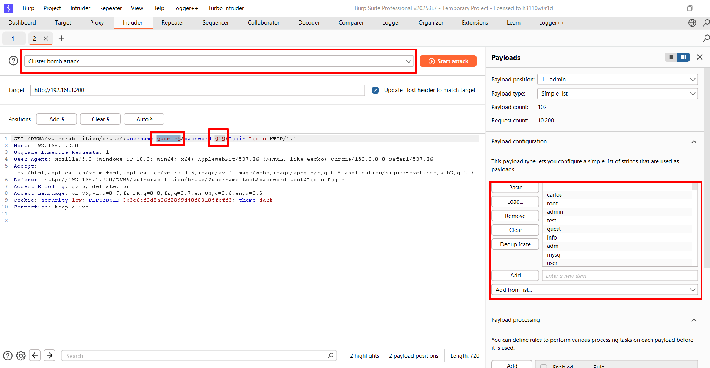

Ta sẽ lấy thử 1 danh sách tài khoản và mật khẩu từ PortSwigger để demo ([username list](https://portswigger.net/web-security/authentication/auth-lab-usernames) và [password list](https://portswigger.net/web-security/authentication/auth-lab-passwords))

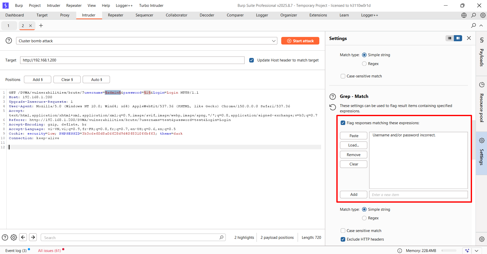

Trong phần cài đặt `Grep - Match` để làm dấu hiệu nhận biết 

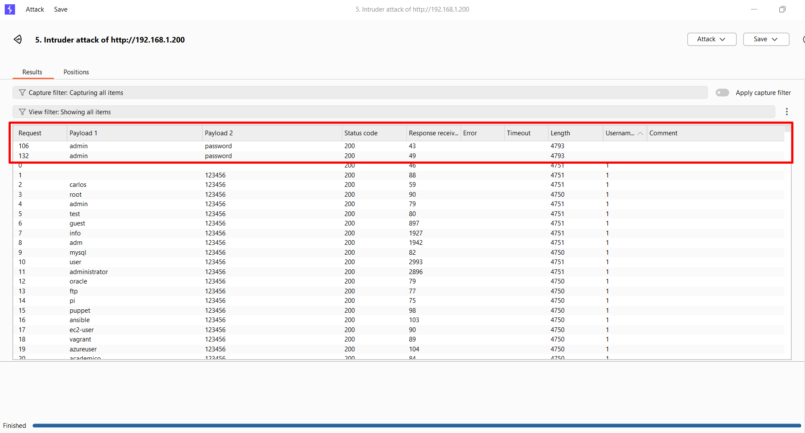

Sau khi chạy xong, ta thấy request có `username=admin` và `password=password` không có `Username and/or password incorrect.`

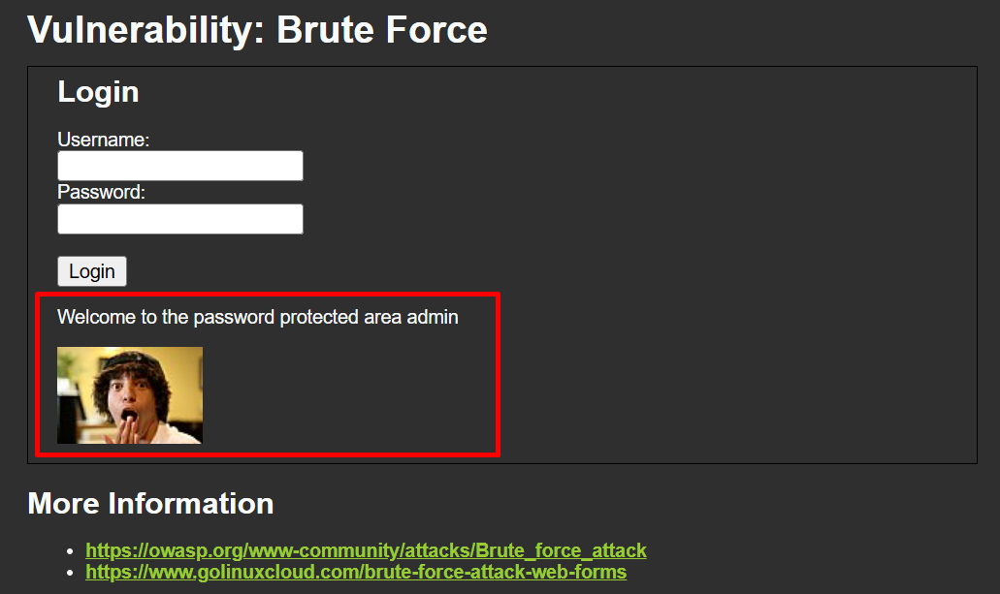

Ta thử đăng nhập bằng thông tin đó, kết quả là đã đăng nhập thành công 

#### **Phân tích mã nguồn**
```php

<?php
if( isset( $_GET[ 'Login' ] ) ) {
    // Get username
    $user = $_GET[ 'username' ];

    // Get password
    $pass = $_GET[ 'password' ];
    $pass = md5( $pass );

    // Check the database
    $query  = "SELECT * FROM `users` WHERE user = '$user' AND password = '$pass';";
    $result = mysqli_query($GLOBALS["___mysqli_ston"],  $query ) or die( '<pre>' . ((is_object($GLOBALS["___mysqli_ston"])) ? mysqli_error($GLOBALS["___mysqli_ston"]) : (($___mysqli_res = mysqli_connect_error()) ? $___mysqli_res : false)) . '</pre>' );

    if( $result && mysqli_num_rows( $result ) == 1 ) {
        // Get users details
        $row    = mysqli_fetch_assoc( $result );
        $avatar = $row["avatar"];

        // Login successful
        echo "<p>Welcome to the password protected area {$user}</p>";
        echo "";
    }
    else {
        // Login failed
        echo "<pre><br />Username and/or password incorrect.</pre>";
    }

    ((is_null($___mysqli_res = mysqli_close($GLOBALS["___mysqli_ston"]))) ? false : $___mysqli_res);
}

?>
```

Ta có thể thấy được cơ chế xác thực khá đơn giản

`$GET` là một biến mảng toàn cục đo PHP tạo ra, nó lưu trữ toàn bộ những tham số được gửi lên bằng method `GET`

Sau đó lấy **username**, **password** (*MD5*) do người dùng gửi lên rồi truy vấn DB để lấy thông tin

--> Ta có thể gửi vô số request mà không bị giới hạn gì do không có cơ chế đếm, kiểm tra IP, ...

---

### **Medium**
```php
<?php

if( isset( $_GET[ 'Login' ] ) ) {
    // Sanitise username input
    $user = $_GET[ 'username' ];
    $user = ((isset($GLOBALS["___mysqli_ston"]) && is_object($GLOBALS["___mysqli_ston"])) ? mysqli_real_escape_string($GLOBALS["___mysqli_ston"],  $user ) : ((trigger_error("[MySQLConverterToo] Fix the mysql_escape_string() call! This code does not work.", E_USER_ERROR)) ? "" : ""));

    // Sanitise password input
    $pass = $_GET[ 'password' ];
    $pass = ((isset($GLOBALS["___mysqli_ston"]) && is_object($GLOBALS["___mysqli_ston"])) ? mysqli_real_escape_string($GLOBALS["___mysqli_ston"],  $pass ) : ((trigger_error("[MySQLConverterToo] Fix the mysql_escape_string() call! This code does not work.", E_USER_ERROR)) ? "" : ""));
    $pass = md5( $pass );

    // Check the database
    $query  = "SELECT * FROM `users` WHERE user = '$user' AND password = '$pass';";
    $result = mysqli_query($GLOBALS["___mysqli_ston"],  $query ) or die( '<pre>' . ((is_object($GLOBALS["___mysqli_ston"])) ? mysqli_error($GLOBALS["___mysqli_ston"]) : (($___mysqli_res = mysqli_connect_error()) ? $___mysqli_res : false)) . '</pre>' );

    if( $result && mysqli_num_rows( $result ) == 1 ) {
        // Get users details
        $row    = mysqli_fetch_assoc( $result );
        $avatar = $row["avatar"];

        // Login successful
        echo "<p>Welcome to the password protected area {$user}</p>";
        echo "";
    }
    else {
        // Login failed
        sleep( 2 );
        echo "<pre><br />Username and/or password incorrect.</pre>";
    }

    ((is_null($___mysqli_res = mysqli_close($GLOBALS["___mysqli_ston"]))) ? false : $___mysqli_res);
}

?>
```

Phần này ta thấy phần biến `$user` đã được verify kĩ hơn bằng hàm `mysqli_real_escape_string()`, hàm này sẽ thêm dấu escape vào trước những kí tự đặc biệt\
VD: `test' or 1=1'-`- --> `test\' or 1=1\'--`

--> Web sẽ tránh được **SQL injection** do đã escape input

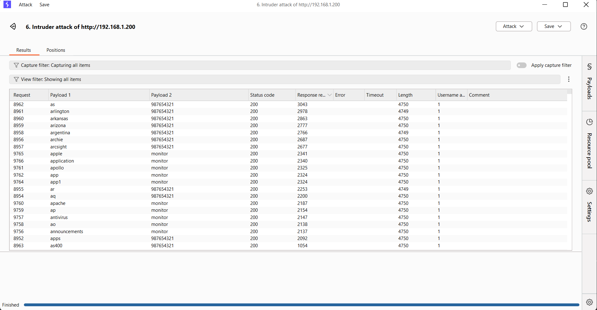

Nhưng khi **brute-force**, ta thấy được web vẫn cho ra kết quả như trước do chưa có bước nào kiểm tra số request, ...

> Level này chỉ escape những kí tự đặc biệt chứ chưa hề có những biện pháp để chống lại **Brute-Force**

## **High**
```php

<?php

if( isset( $_GET[ 'Login' ] ) ) {
    // Check Anti-CSRF token
    checkToken( $_REQUEST[ 'user_token' ], $_SESSION[ 'session_token' ], 'index.php' );

    // Sanitise username input
    $user = $_GET[ 'username' ];
    $user = stripslashes( $user );
    $user = ((isset($GLOBALS["___mysqli_ston"]) && is_object($GLOBALS["___mysqli_ston"])) ? mysqli_real_escape_string($GLOBALS["___mysqli_ston"],  $user ) : ((trigger_error("[MySQLConverterToo] Fix the mysql_escape_string() call! This code does not work.", E_USER_ERROR)) ? "" : ""));

    // Sanitise password input
    $pass = $_GET[ 'password' ];
    $pass = stripslashes( $pass );
    $pass = ((isset($GLOBALS["___mysqli_ston"]) && is_object($GLOBALS["___mysqli_ston"])) ? mysqli_real_escape_string($GLOBALS["___mysqli_ston"],  $pass ) : ((trigger_error("[MySQLConverterToo] Fix the mysql_escape_string() call! This code does not work.", E_USER_ERROR)) ? "" : ""));
    $pass = md5( $pass );

    // Check database
    $query  = "SELECT * FROM `users` WHERE user = '$user' AND password = '$pass';";
    $result = mysqli_query($GLOBALS["___mysqli_ston"],  $query ) or die( '<pre>' . ((is_object($GLOBALS["___mysqli_ston"])) ? mysqli_error($GLOBALS["___mysqli_ston"]) : (($___mysqli_res = mysqli_connect_error()) ? $___mysqli_res : false)) . '</pre>' );

    if( $result && mysqli_num_rows( $result ) == 1 ) {
        // Get users details
        $row    = mysqli_fetch_assoc( $result );
        $avatar = $row["avatar"];

        // Login successful
        echo "<p>Welcome to the password protected area {$user}</p>";
        echo "";
    }
    else {
        // Login failed
        sleep( rand( 0, 3 ) );
        echo "<pre><br />Username and/or password incorrect.</pre>";
    }

    ((is_null($___mysqli_res = mysqli_close($GLOBALS["___mysqli_ston"]))) ? false : $___mysqli_res);
}

// Generate Anti-CSRF token
generateSessionToken();

?>
```

Level này đã thêm hàm `checkToken()` dùng để kiểm tra **CSRF Token** và **Session Token**

Hàm `stripslashes()` dùng để xóa những dấu `\` mà PHP tự thêm vào trước từng kí tự người dùng nhập vào để tránh việc nhập nhàng và phá vỡ câu lệnh ở những phiên bản PHP cũ

Sau đó `mysqli_real_escape_string()` lại thêm lại `\` vào những kí tự đặc biệt

Nhưng trong đoạn code trên chỉ tránh được những lỗ hổng khác như **SQL injection**, **CSRF**, **Broken Access Control** nhưng lại chưa có cơ chế xác thực nào để chống lại **Brute-Force** 

Vậy nên việc tấn công Brute-Force vẫn hoạt động bình thường

## **Impossible**
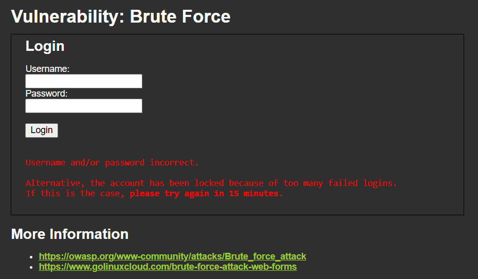

Ở level này, chỉ cần đăng nhập sai `3` lần thì web đã thông báo block 15 phút

```php

<?php

if( isset( $_POST[ 'Login' ] ) && isset ($_POST['username']) && isset ($_POST['password']) ) {
    // Check Anti-CSRF token
    checkToken( $_REQUEST[ 'user_token' ], $_SESSION[ 'session_token' ], 'index.php' );

    // Sanitise username input
    $user = $_POST[ 'username' ];
    $user = stripslashes( $user );
    $user = ((isset($GLOBALS["___mysqli_ston"]) && is_object($GLOBALS["___mysqli_ston"])) ? mysqli_real_escape_string($GLOBALS["___mysqli_ston"],  $user ) : ((trigger_error("[MySQLConverterToo] Fix the mysql_escape_string() call! This code does not work.", E_USER_ERROR)) ? "" : ""));

    // Sanitise password input
    $pass = $_POST[ 'password' ];
    $pass = stripslashes( $pass );
    $pass = ((isset($GLOBALS["___mysqli_ston"]) && is_object($GLOBALS["___mysqli_ston"])) ? mysqli_real_escape_string($GLOBALS["___mysqli_ston"],  $pass ) : ((trigger_error("[MySQLConverterToo] Fix the mysql_escape_string() call! This code does not work.", E_USER_ERROR)) ? "" : ""));
    $pass = md5( $pass );

    // Default values
    $total_failed_login = 3;
    $lockout_time       = 15;
    $account_locked     = false;

    // Check the database (Check user information)
    $data = $db->prepare( 'SELECT failed_login, last_login FROM users WHERE user = (:user) LIMIT 1;' );
    $data->bindParam( ':user', $user, PDO::PARAM_STR );
    $data->execute();
    $row = $data->fetch();

    // Check to see if the user has been locked out.
    if( ( $data->rowCount() == 1 ) && ( $row[ 'failed_login' ] >= $total_failed_login ) )  {
        // User locked out.  Note, using this method would allow for user enumeration!
        //echo "<pre><br />This account has been locked due to too many incorrect logins.</pre>";

        // Calculate when the user would be allowed to login again
        $last_login = strtotime( $row[ 'last_login' ] );
        $timeout    = $last_login + ($lockout_time * 60);
        $timenow    = time();

        /*
        print "The last login was: " . date ("h:i:s", $last_login) . "<br />";
        print "The timenow is: " . date ("h:i:s", $timenow) . "<br />";
        print "The timeout is: " . date ("h:i:s", $timeout) . "<br />";
        */

        // Check to see if enough time has passed, if it hasn't locked the account
        if( $timenow < $timeout ) {
            $account_locked = true;
            // print "The account is locked<br />";
        }
    }

    // Check the database (if username matches the password)
    $data = $db->prepare( 'SELECT * FROM users WHERE user = (:user) AND password = (:password) LIMIT 1;' );
    $data->bindParam( ':user', $user, PDO::PARAM_STR);
    $data->bindParam( ':password', $pass, PDO::PARAM_STR );
    $data->execute();
    $row = $data->fetch();

    // If its a valid login...
    if( ( $data->rowCount() == 1 ) && ( $account_locked == false ) ) {
        // Get users details
        $avatar       = $row[ 'avatar' ];
        $failed_login = $row[ 'failed_login' ];
        $last_login   = $row[ 'last_login' ];

        // Login successful
        echo "<p>Welcome to the password protected area <em>{$user}</em></p>";
        echo "";

        // Had the account been locked out since last login?
        if( $failed_login >= $total_failed_login ) {
            echo "<p><em>Warning</em>: Someone might of been brute forcing your account.</p>";
            echo "<p>Number of login attempts: <em>{$failed_login}</em>.<br />Last login attempt was at: <em>{$last_login}</em>.</p>";
        }

        // Reset bad login count
        $data = $db->prepare( 'UPDATE users SET failed_login = "0" WHERE user = (:user) LIMIT 1;' );
        $data->bindParam( ':user', $user, PDO::PARAM_STR );
        $data->execute();
    } else {
        // Login failed
        sleep( rand( 2, 4 ) );

        // Give the user some feedback
        echo "<pre><br />Username and/or password incorrect.<br /><br/>Alternative, the account has been locked because of too many failed logins.<br />If this is the case, <em>please try again in {$lockout_time} minutes</em>.</pre>";

        // Update bad login count
        $data = $db->prepare( 'UPDATE users SET failed_login = (failed_login + 1) WHERE user = (:user) LIMIT 1;' );
        $data->bindParam( ':user', $user, PDO::PARAM_STR );
        $data->execute();
    }

    // Set the last login time
    $data = $db->prepare( 'UPDATE users SET last_login = now() WHERE user = (:user) LIMIT 1;' );
    $data->bindParam( ':user', $user, PDO::PARAM_STR );
    $data->execute();
}

// Generate Anti-CSRF token
generateSessionToken();

?>
```

Ở level này ta đã thấy chức năng từng user đã có thêm cột `failed_login` và `last_login` để kiếm tra số lần cố gắng đăng nhập và lần cuối đăng nhập

Method đã đổi từ `GET` sang `POST` để đúng tiêu chuẩn hơn

Level này cũng đã có rate limit thông qua hàm `sleep( rand( 2, 4 ) )`

## Cách phòng chống
- Ta thấy được mã nguồn của level Impossible đã thêm chức năng:
    - Rate Limiting
    - Kiểm tra số lần đăng nhập
    - Sử dụng method `POST` thay vì `GET` với những site gửi data
- Ngoài ra ta còn có thể thêm:
    - CAPTCHA 
    - MFA

để có thể bảo mật hơn 


