# **SQL Injection**
## **Tổng quan**

SQL Injection (SQLi) là lỗ hổng cho phép kẻ tấn công chèn và thực thi các **câu lệnh SQL độc hại** thông qua dữ liệu đầu vào của ứng dụng.

Lỗ hổng này thường xuất hiện khi ứng dụng:

* Nhận dữ liệu trực tiếp từ người dùng.
* Ghép dữ liệu đó vào câu truy vấn SQL.
* Không kiểm tra hoặc xác thực dữ liệu đầu vào.
* Không sử dụng **Prepared Statement** hoặc **Parameterized Query**.
* Hiển thị thông báo lỗi cơ sở dữ liệu quá chi tiết.
* Kết nối cơ sở dữ liệu bằng tài khoản có quyền quá cao.

Kẻ tấn công có thể sử dụng các ký tự và từ khóa SQL như `'`, `"`, `--`, `OR`, `AND`, `UNION SELECT` hoặc các truy vấn con để thay đổi logic của câu truy vấn ban đầu.

Thông qua SQL Injection, kẻ tấn công có thể vượt qua chức năng đăng nhập, đọc dữ liệu nhạy cảm, xác định cấu trúc cơ sở dữ liệu, thêm, sửa hoặc xóa dữ liệu. Trong một số trường hợp nghiêm trọng, lỗ hổng còn có thể dẫn đến việc chiếm quyền kiểm soát cơ sở dữ liệu hoặc máy chủ.

Trong DVWA, mục tiêu của bài lab là phân tích chức năng truy vấn thông tin người dùng, sau đó chèn thêm câu lệnh SQL vào dữ liệu đầu vào. Ở mỗi mức bảo mật **Low, Medium, High và Impossible**, ứng dụng sẽ bổ sung các cơ chế kiểm tra, lọc, xác thực dữ liệu hoặc sử dụng truy vấn tham số hóa nhằm hạn chế và ngăn chặn SQL Injection.

## **Security Level**
### **Low**
#### **Cách khai thác**

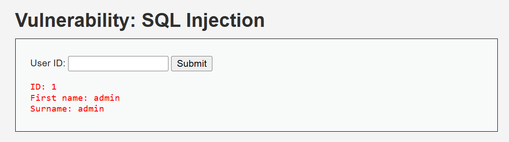

- Web cho ta 1 form có thể tìm kiếm thông tin bằng ID người dùng
- Ví dụ: nhập `ID` = `1` thì nó sẽ trả về thông tin của người dùng tương ứng

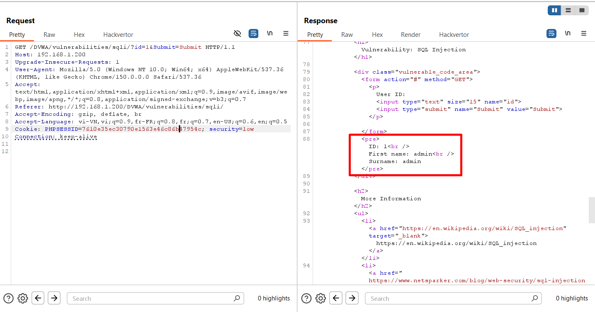

- Ở Burp, khi ta gửi request bằng ID hợp lệ, ta sẽ nhận được thông tin như bình thường và mã trạng thái trả về `200`

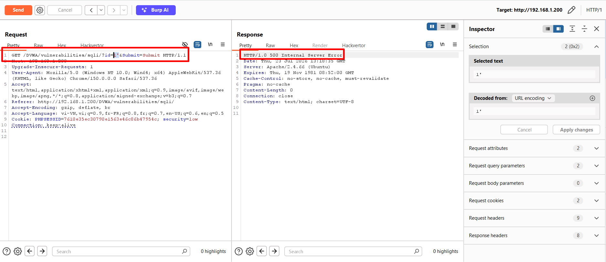

- Khi ta thêm dấu `'` vào sau input thì đã xảy ra lỗi từ phía trang web (*Status code: `500`*)

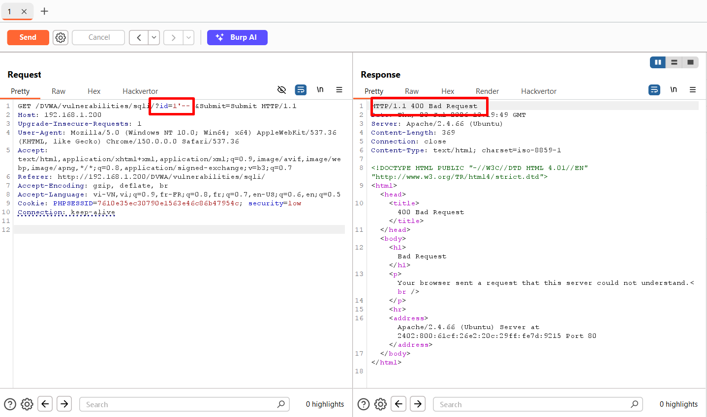

- Khi thêm vào dấu `-- ` (*bao gồm cả dấu cách*) thì status code trả về `400`, tức là hiện tại không phải lỗi từ server nữa mà lỗi từ bên client

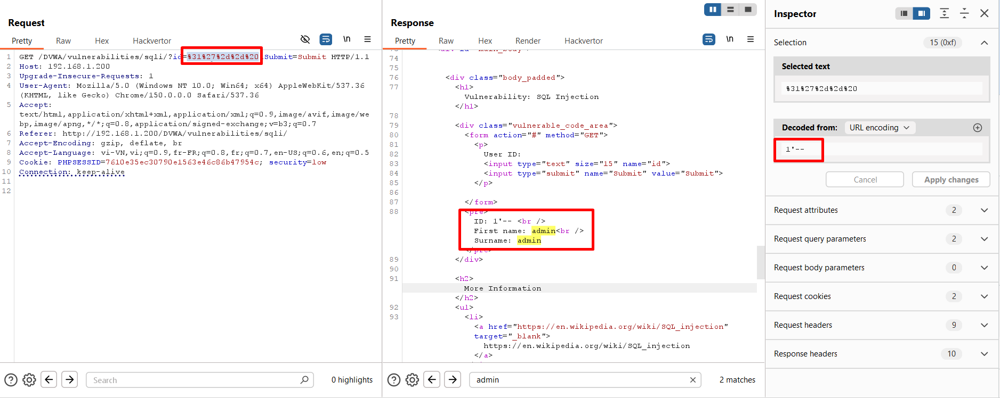

- Khi ta thực hiện mã hóa toàn bộ input đưa vào bằng **URL encode**, ta nhận lại nhận được phản hồi như thường 
- Vậy nên từ những payload về sau, tất cả đều phải được encode sang URL rồi mới gửi đi

- Ta bắt đầu chèn những câu lệnh SQL vào

```sql
1' UNION SELECT NULL-- 
```

- Câu lệnh này sẽ sử dụng toán tử `UNION` để có thể thực hiện việc nối nối các cột với nhau, nhưng với điều kiện là số lượng cột của 2 vế phải bằng nhau

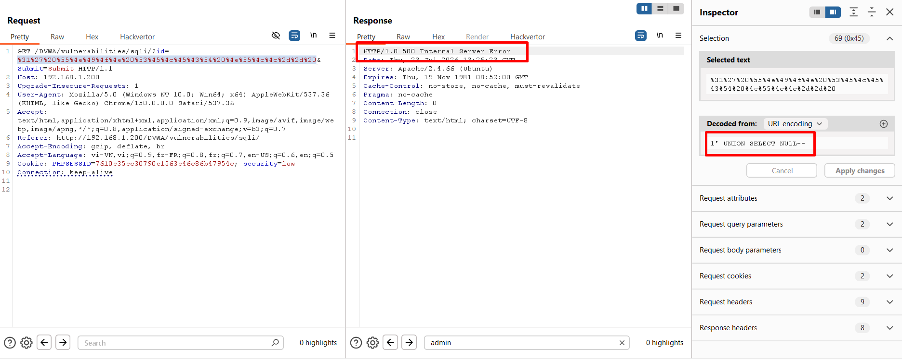

- Ta thu được kết quả là lỗi phía server 
- Ta tiếp thực bổ sung thêm để dò xem liệu câu lệnh phía trước có bao nhiêu cột

```sql
1' UNION SELECT NULL,NULL-- 
```

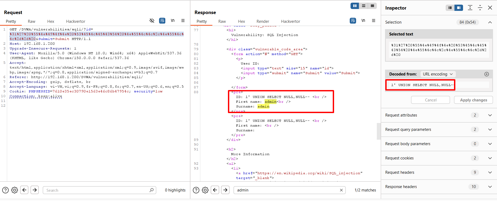

- Khi này ta thấy web trả về dữ liệu bình thường
- Từ đó ta có thể kết luận được rằng vế đăng trước của truy vấn sẽ truy vấn 2 cột

- Trước đó ta đã biết được rằng web được dựng bằng MySQL, nên ta có thực hiện truy vấn bằng những câu truy vấn MySQL; trong thực tế, ta thường phải thử các truy vấn của các thế loại SQL khác nhau để có thể kết luận được web sử dụng loại SQL nào
- Tiếp theo, ta thực hiện tìm tên của DB bằng hàm `database()`

```sql
1' UNION SELECT NULL,database()-- 
```

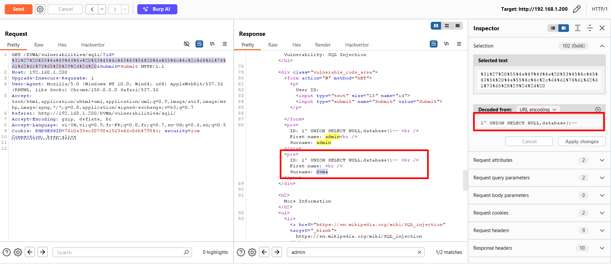

- Từ kết quả, ta có thể biết được tên của DB hiện tại là `dvwa`
- Tiếp theo ta sẽ tìm những bảng có trong DB này

```sql
1' UNION SELECT NULL,group_concat(table_name) FROM information_schema.tables WHERE table_schema='dvwa'-- 
```

- `information_schema.tables` là một bảng chứa thôn tin về tất cả các bảng trong DB
- `table_name`: là cột chứa tên của các bảng
- `group_concat()`: hàm này dùng để nối tất cả dữ liệu thành một chuỗi, mặc định phân cách nhau bằng dấu `'`
- Payload này có tác dụng là truy vấn tất cả tên của các bảng trong DB có tên là `dvwa`

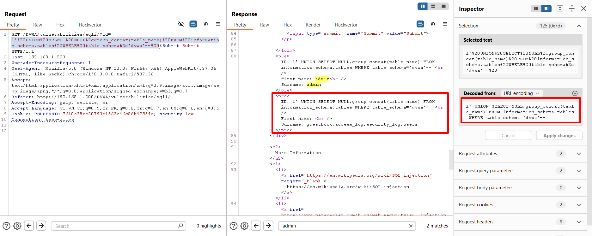

- Kết quả trả về cho chúng ta `dvwa` có 4 bảng là: `guestbook`,`access_log`,`security_log`,`users`
- Ta muốn lấy tất cả tên người dùng và mật khẩu của họ, nên ta thấy có bảng `users` có khả năng chứa thông tin người dùng 
- Vì vậy, ta sẽ lấy tất cả tên của các cột trong bảng này để có thể thực hiện truy vấn lấy chính xác 2 cột username và password

```sql
1' UNION SELECT NULL,group_concat(column_name) FROM information_schema.columns WHERE table_name='users'-- 
```

- `information_schema.columns`: là một bảng chứa tất cả các cột trong DB
- `column_name`: tên một cột trong bảng `information_schema.columns` chứa tên của tất cả các cột trong DB
- Payload này có tác dụng lấy hết tất cả tên của các cột của DB `dvwa` 

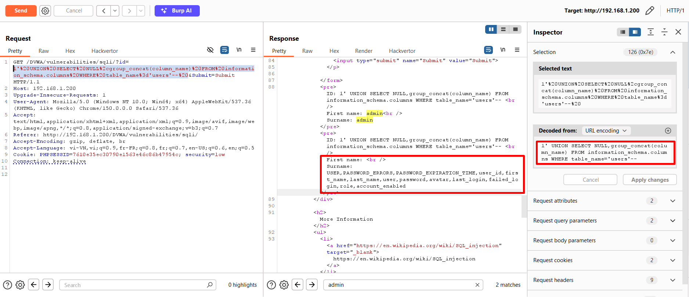

- Dựa vào kết quả, ta thụ được các cột là `USER`,`PASSWORD_ERRORS`,`PASSWORD_EXPIRATION_TIME`,`user_id`,`first_name`,`last_name`,`user`,`password`,`avatar`,`last_login`,`failed_login`,`role`,`account_enabled`
- Từ những cột này, ta có thẻ thấy được có cột là `user` và `password` chứa username và password của người dùng
- Bước cuối cùng, ta lấy tất cả `user` và `password` của người dùng trong DB

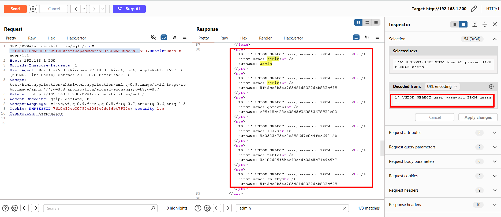

- Nhìn vào kết quả, ta đã lấy được tất cả username, password của người dùng trong DB, nhưng password lại được lưu dưới dạng MD5

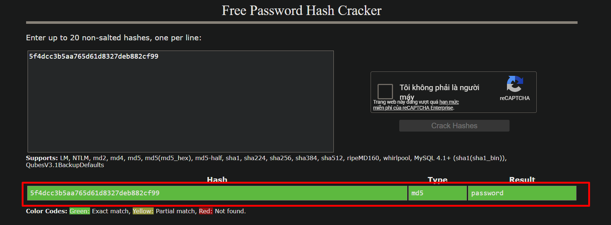

#### **Phân tích mã nguồn**
```php
<?php

if( isset( $_REQUEST[ 'Submit' ] ) ) {
    // Get input
    $id = $_REQUEST[ 'id' ];

    switch ($_DVWA['SQLI_DB']) {
        case MYSQL:
            // Check database
            $query  = "SELECT first_name, last_name FROM users WHERE user_id = '$id';";
            $result = mysqli_query($GLOBALS["___mysqli_ston"],  $query ) or die( '<pre>' . ((is_object($GLOBALS["___mysqli_ston"])) ? mysqli_error($GLOBALS["___mysqli_ston"]) : (($___mysqli_res = mysqli_connect_error()) ? $___mysqli_res : false)) . '</pre>' );

            // Get results
            while( $row = mysqli_fetch_assoc( $result ) ) {
                // Get values
                $first = $row["first_name"];
                $last  = $row["last_name"];

                // Feedback for end user
                echo "<pre>ID: {$id}<br />First name: {$first}<br />Surname: {$last}</pre>";
            }

            mysqli_close($GLOBALS["___mysqli_ston"]);
            break;
        case SQLITE:
            global $sqlite_db_connection;

            #$sqlite_db_connection = new SQLite3($_DVWA['SQLITE_DB']);
            #$sqlite_db_connection->enableExceptions(true);

            $query  = "SELECT first_name, last_name FROM users WHERE user_id = '$id';";
            #print $query;
            try {
                $results = $sqlite_db_connection->query($query);
            } catch (Exception $e) {
                echo 'Caught exception: ' . $e->getMessage();
                exit();
            }

            if ($results) {
                while ($row = $results->fetchArray()) {
                    // Get values
                    $first = $row["first_name"];
                    $last  = $row["last_name"];

                    // Feedback for end user
                    echo "<pre>ID: {$id}<br />First name: {$first}<br />Surname: {$last}</pre>";
                }
            } else {
                echo "Error in fetch ".$sqlite_db->lastErrorMsg();
            }
            break;
    } 
}

?>
```

- Nguyên nhân chính gây ra lỗ hổng đó chính là ghép thẳng input của người dùng vào với truy vấn SQL mà không kiểm tra tính hợp lệ

```php
$query  = "SELECT first_name, last_name FROM users WHERE user_id = '$id';";
```

- Biến ID lưu giá trị người dùng nhập vào 
- Sau đó nó được ghép thẳng vào câu truy vấn

VD: nếu người dùng nhập giá trị hợp lệ là `1`, thì câu truy vẫn sẽ là

```sql
SELECT first_name, last_name FROM users WHERE user_id = '1';
```

- Khi đó, câu lệnh sẽ truy vấn và lấy đúng 2 trường thông tin là `first_name` và `last_name`
- Nhưng khi người dùng cố nhập thêm kí tự `'`, câu lệnh sẽ trở thành 

```sql
SELECT first_name, last_name FROM users WHERE user_id = '1'';
```

- Điều đó là cho câu truy vấn bị lỗi và do đó bị lỗi từ phía server
- Và khi người dùng nhập thêm `-- `

```sql
SELECT first_name, last_name FROM users WHERE user_id = '1'-- ';
```

- `-- ` là dấu comment trong MySQL, vì vậy tất cả những kí tự đằng sau nó bị bỏ qua, vì vậy câu lện truy vấn trở lại bình thường
- Khi thêm `UNION` để nối, ta phải dùng 2 cột `NULL` do vế phải có 2 cột

```sql
SELECT first_name, last_name FROM users WHERE user_id = '1' UNION SELECT NULL,NULL--';
```

- Các câu truy vấn sau cũng tương tự

### **Medium**
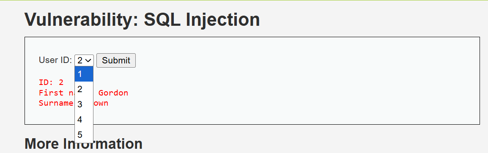

- Ở level này, web đã đổi phương thức truyền tham số, không cho người dùng nhập thẳng input vào nữa
- Vậy thì ta gửi request rồi sang Burp để quan sát

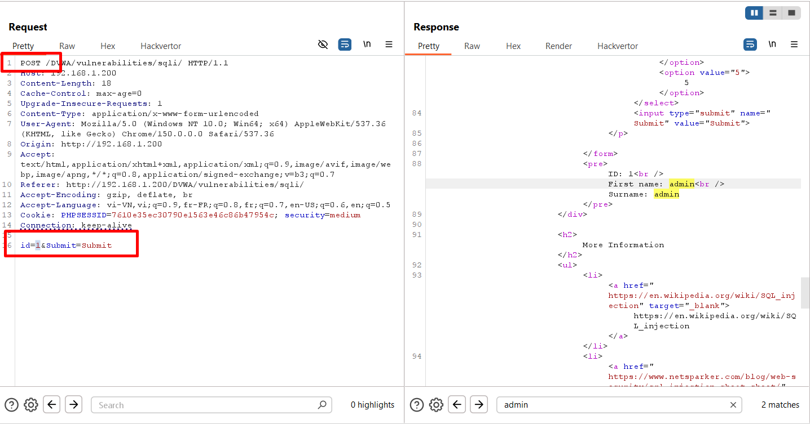

- Tại đây ta có thể thấy rằng phương thức đã được chuyển sang `POST`

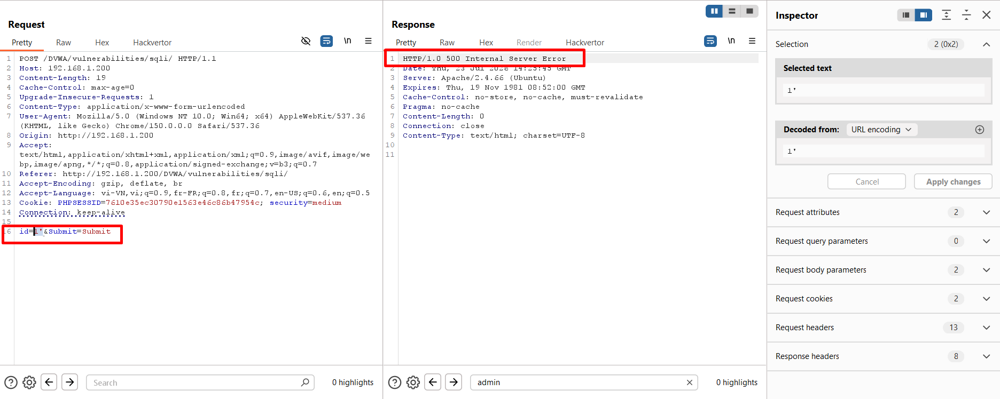

- Tiếp tục gửi thêm dấu `'`, ta thấy được web đã  trả về lỗi
- Khi đó ta thêm `-- ` để comment

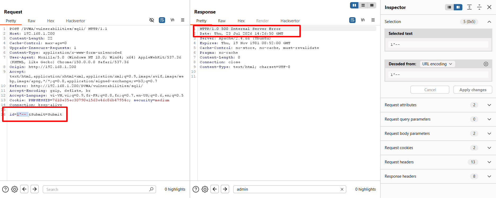

- Nhưng kết quả vẫn trả về lỗi
- Ta thử thêm comment ở đằng sau xem web có kiểm tra và xóa comment ở cuối của ta đi không

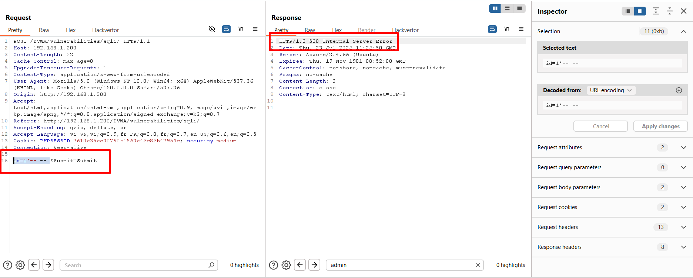

- Nhưng kết quả vẫn là `500`
- Vậy nên ta thử bỏ dấu `'` xem web phản hồi như thế nào

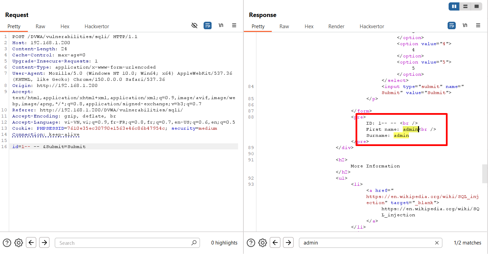

- Khi đó web lại phản hồi như bình thường, liệu rằng dấu `'` có cần thiết ở đây không
- Ta tiếp tục thêm thẳng payload vào 

```sql
1 UNION SELECT NULL,database()-- 
```

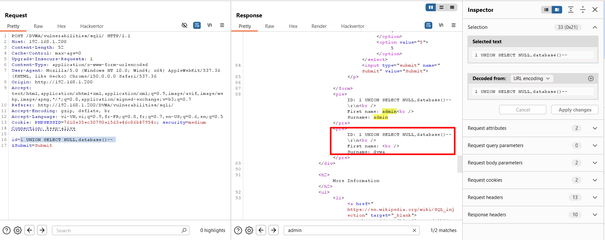

- Kết quả, ta thấy web trả về tên của DB, từ đó ta có thể xác nhận được ở trường hợp này payload không cần dấu `'` để phá cấu trúc của câu lệnh SQL
- Ta tiếp tục khai thác thông tin người dùng 

```sql
1 UNION SELECT user,password FROM users-- 
```

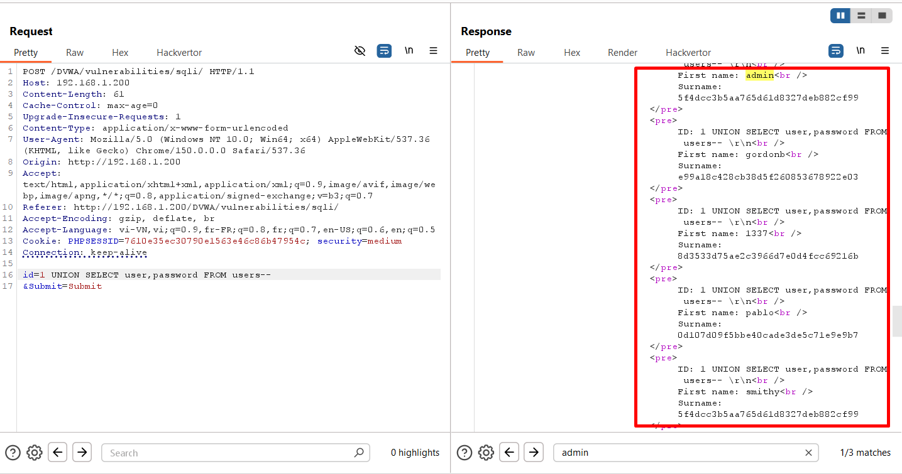

- Kết quả là web đã trả về tất cả thông tin của người dùng

#### **Phân tích mã nguồn**
```php
<?php

if( isset( $_POST[ 'Submit' ] ) ) {
    // Get input
    $id = $_POST[ 'id' ];

    $id = mysqli_real_escape_string($GLOBALS["___mysqli_ston"], $id);

    switch ($_DVWA['SQLI_DB']) {
        case MYSQL:
            $query  = "SELECT first_name, last_name FROM users WHERE user_id = $id;";
            $result = mysqli_query($GLOBALS["___mysqli_ston"], $query) or die( '<pre>' . mysqli_error($GLOBALS["___mysqli_ston"]) . '</pre>' );

            // Get results
            while( $row = mysqli_fetch_assoc( $result ) ) {
                // Display values
                $first = $row["first_name"];
                $last  = $row["last_name"];

                // Feedback for end user
                echo "<pre>ID: {$id}<br />First name: {$first}<br />Surname: {$last}</pre>";
            }
            break;
        case SQLITE:
            global $sqlite_db_connection;

            $query  = "SELECT first_name, last_name FROM users WHERE user_id = $id;";
            #print $query;
            try {
                $results = $sqlite_db_connection->query($query);
            } catch (Exception $e) {
                echo 'Caught exception: ' . $e->getMessage();
                exit();
            }

            if ($results) {
                while ($row = $results->fetchArray()) {
                    // Get values
                    $first = $row["first_name"];
                    $last  = $row["last_name"];

                    // Feedback for end user
                    echo "<pre>ID: {$id}<br />First name: {$first}<br />Surname: {$last}</pre>";
                }
            } else {
                echo "Error in fetch ".$sqlite_db->lastErrorMsg();
            }
            break;
    }
}

// This is used later on in the index.php page
// Setting it here so we can close the database connection in here like in the rest of the source scripts
$query  = "SELECT COUNT(*) FROM users;";
$result = mysqli_query($GLOBALS["___mysqli_ston"],  $query ) or die( '<pre>' . ((is_object($GLOBALS["___mysqli_ston"])) ? mysqli_error($GLOBALS["___mysqli_ston"]) : (($___mysqli_res = mysqli_connect_error()) ? $___mysqli_res : false)) . '</pre>' );
$number_of_rows = mysqli_fetch_row( $result )[0];

mysqli_close($GLOBALS["___mysqli_ston"]);
?>
```

- Khác biệt duy nhất ở level Medium và level Low chỉ là các nối và so sánh
- Ở level trước, câu lệnh sẽ so sánh dữ liệu dưới dạng chuối (trong dấu `''`)

```php
$query  = "SELECT first_name, last_name FROM users WHERE user_id = '$id';";
```

- Còn ở level này, do dev tin tưởng rằng người dùng chỉ được chọn trên UI nên đã so sánh thẳng bằng số nguyên được lấy từ request

```php
$query  = "SELECT first_name, last_name FROM users WHERE user_id = $id;";
```

## **High**
#### **Cách khai thác**
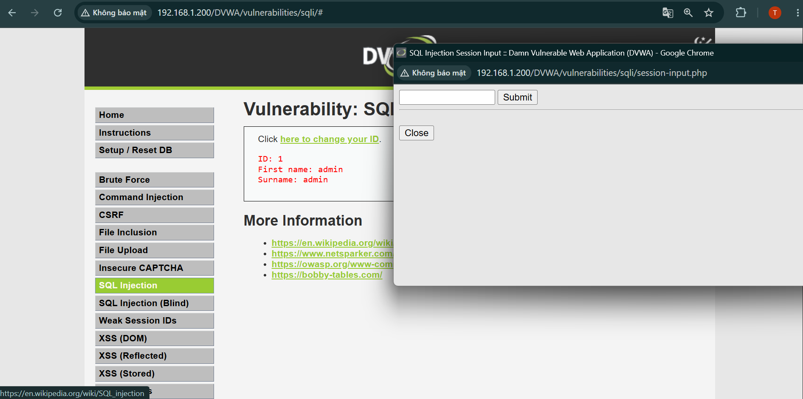

- Ở level này, web yêu cầu nhập ID từ `/session-input.php` rồi server nhận phản hồi xử lý rồi gửi lại cho trang chính

- Ta thử nhập lại payload vào `/session-input.php`

```php
1' UNION SELECT user,password FROM users-- 
```

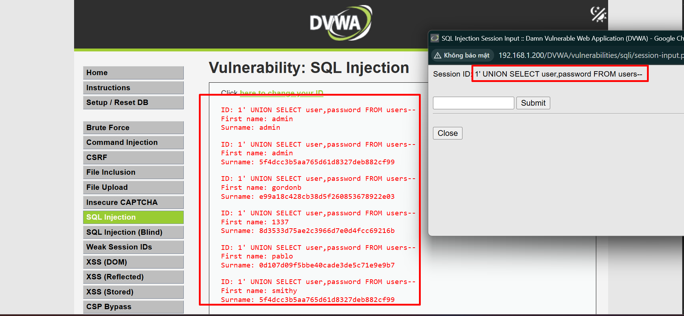

- Kết quả vẫn như các level khác, thông tin của người dùng đều được lấy ra hết

#### **Phân tích mã nguồn**
```php
<?php

if( isset( $_SESSION [ 'id' ] ) ) {
    // Get input
    $id = $_SESSION[ 'id' ];

    switch ($_DVWA['SQLI_DB']) {
        case MYSQL:
            // Check database
            $query  = "SELECT first_name, last_name FROM users WHERE user_id = '$id' LIMIT 1;";
            $result = mysqli_query($GLOBALS["___mysqli_ston"], $query ) or die( '<pre>Something went wrong.</pre>' );

            // Get results
            while( $row = mysqli_fetch_assoc( $result ) ) {
                // Get values
                $first = $row["first_name"];
                $last  = $row["last_name"];

                // Feedback for end user
                echo "<pre>ID: {$id}<br />First name: {$first}<br />Surname: {$last}</pre>";
            }

            ((is_null($___mysqli_res = mysqli_close($GLOBALS["___mysqli_ston"]))) ? false : $___mysqli_res);        
            break;
        case SQLITE:
            global $sqlite_db_connection;

            $query  = "SELECT first_name, last_name FROM users WHERE user_id = '$id' LIMIT 1;";
            #print $query;
            try {
                $results = $sqlite_db_connection->query($query);
            } catch (Exception $e) {
                echo 'Caught exception: ' . $e->getMessage();
                exit();
            }

            if ($results) {
                while ($row = $results->fetchArray()) {
                    // Get values
                    $first = $row["first_name"];
                    $last  = $row["last_name"];

                    // Feedback for end user
                    echo "<pre>ID: {$id}<br />First name: {$first}<br />Surname: {$last}</pre>";
                }
            } else {
                echo "Error in fetch ".$sqlite_db->lastErrorMsg();
            }
            break;
    }
}

?>
```

- Source code này cũng vẫn tương tự như những level trước, chủ yếu thêm được toán tử `LIMIT` nhưng nó không quan trọng 

VD: payload `1' UNION SELECT user,password FROM users-- `

```sql
SELECT first_name, last_name FROM users WHERE user_id = '1' UNION SELECT user,password FROM users-- ' LIMIT 1;
``` 

- Khi đó, vế LIMIT đã bị dấu comment bỏ qua nên nó không có tác dụng

## **Impossible**
```php
<?php

if( isset( $_GET[ 'Submit' ] ) ) {
    // Check Anti-CSRF token
    checkToken( $_REQUEST[ 'user_token' ], $_SESSION[ 'session_token' ], 'index.php' );

    // Get input
    $id = $_GET[ 'id' ];

    // Was a number entered?
    if(is_numeric( $id )) {
        $id = intval ($id);
        switch ($_DVWA['SQLI_DB']) {
            case MYSQL:
                // Check the database
                $data = $db->prepare( 'SELECT first_name, last_name FROM users WHERE user_id = (:id) LIMIT 1;' );
                $data->bindParam( ':id', $id, PDO::PARAM_INT );
                $data->execute();
                $row = $data->fetch();

                // Make sure only 1 result is returned
                if( $data->rowCount() == 1 ) {
                    // Get values
                    $first = $row[ 'first_name' ];
                    $last  = $row[ 'last_name' ];

                    // Feedback for end user
                    echo "<pre>ID: {$id}<br />First name: {$first}<br />Surname: {$last}</pre>";
                }
                break;
            case SQLITE:
                global $sqlite_db_connection;

                $stmt = $sqlite_db_connection->prepare('SELECT first_name, last_name FROM users WHERE user_id = :id LIMIT 1;' );
                $stmt->bindValue(':id',$id,SQLITE3_INTEGER);
                $result = $stmt->execute();
                $result->finalize();
                if ($result !== false) {
                    // There is no way to get the number of rows returned
                    // This checks the number of columns (not rows) just
                    // as a precaution, but it won't stop someone dumping
                    // multiple rows and viewing them one at a time.

                    $num_columns = $result->numColumns();
                    if ($num_columns == 2) {
                        $row = $result->fetchArray();

                        // Get values
                        $first = $row[ 'first_name' ];
                        $last  = $row[ 'last_name' ];

                        // Feedback for end user
                        echo "<pre>ID: {$id}<br />First name: {$first}<br />Surname: {$last}</pre>";
                    }
                }

                break;
        }
    }
}

// Generate Anti-CSRF token
generateSessionToken();

?>
```

- Ở level này, ta đã thấy được rằng web không thực hiện truyền thẳng Input người dùng nhập, mà nó thông qua **PDO**

```php
$data = $db->prepare(
    'SELECT first_name, last_name
     FROM users
     WHERE user_id = (:id)
     LIMIT 1;'
);
```

- Phần này là chuẩn bị câu lệnh truy vấn, chưa thực hiện ngay, phần `:id` ở đây để giữ chỗ trống cho tham số `id`

```php
$data->bindParam( ':id', $id, PDO::PARAM_INT );
```
- Khi này bắt đầu truyền tham số `id` vào nhưng chỉ cho phép nhận số nguyên, nếu sai định dạng, nó sẽ chỉ nhận phần số nguyên hoặc từ chối cả câu lệnh

```php
$data->execute();
```

- Khi này câu lệnh mới được thực thi, khi mà tất cả mọi thứ đã hợp lệ

> Nếu dữ liệu nhập vào không phải số nguyên như ID mà là dữ liệu có thể là dạng chuỗi như name chẳng hạn, vậy thì `PDO::PARAM_STR` có chống được SQLi hay không?

- Câu trả lời là có. Thực ra khi truyền tham số người dùng nhập vào, nó sẽ không ghép vào câu lệnh như các level ở bên trên, mà dữ liệu được truyền vào đúng là dạng chuỗi

VD: nếu nhập `admin' OR 1=1-- ` thì web sẽ đi tìm tên người dùng nào khớp với `admin' OR 1=1-- ` chứ không thực hiện nối chuỗi như các level bên trên

## **Cách phòng chống**

* Sử dụng **Prepared Statement** hoặc **Parameterized Query**.
* Không ghép trực tiếp dữ liệu người dùng vào câu lệnh SQL.
* Kiểm tra kiểu dữ liệu, độ dài và định dạng đầu vào.
* Giới hạn quyền của tài khoản kết nối cơ sở dữ liệu.
* Không hiển thị lỗi SQL chi tiết cho người dùng.
* Cập nhật framework, thư viện và hệ quản trị cơ sở dữ liệu thường xuyên.


